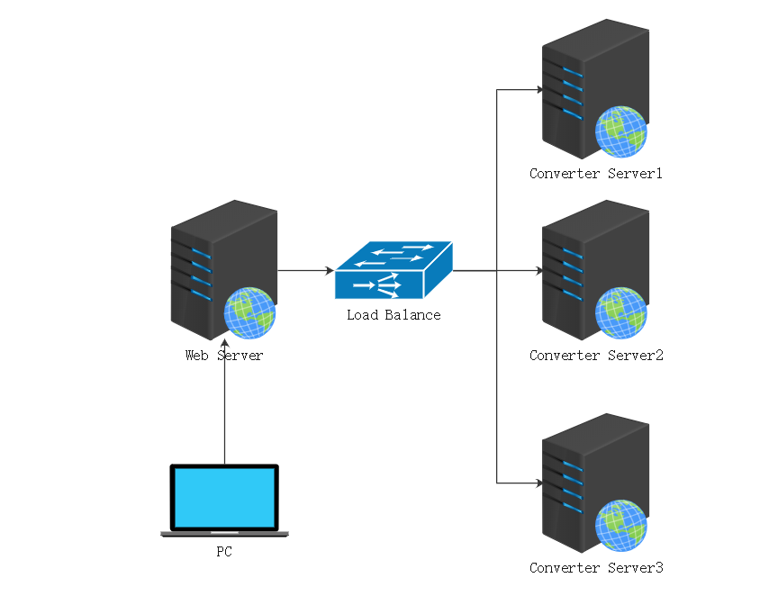

# 3DModelConvertToGltf 统一模型格式转换工具

此项目产生的主要原因是工作中遇到了需要**在Web中展示 STEP 和 IGES 模型的场景**，但是市面上的web3d类库均不支持此格式，并且用户上传的STL文件直接展示会占用大量带宽或CDN流量，转换为压缩后的gltf会比较合适。

样例文件压缩效果如下表：

| 文件类型 | 文件名                   | 转换时间   | 原大小 | 转换后大小 |
| -------- | ------------------------ | ---------- | ------ | ---------- |
| stl      | assets/test.stl          | 2368.890ms | 7.6 MB | 86 KB      |
| iges     | assets/test.iges         | 1641.226ms | 1 M    | 111 KB     |
| stp      | assets/test.stp          | 2969.200ms | 5.1 MB | 217 KB     |
| fbx      | assets/Samba Dancing.fbx | <1000ms    | 3.7 MB | 614 KB     |

**支持输入格式：** STL/IGES/STP/OBJ/FBX

**支持输出格式：** GLTF/GLB

本项目即采用了博客中总结的思路：[STEP和IGES模型转换为适用Web的glb格式](https://blog.wj2015.com/2020/03/08/step%e5%92%8ciges%e6%a8%a1%e5%9e%8b%e8%bd%ac%e6%8d%a2%e4%b8%ba%e9%80%82%e7%94%a8web%e7%9a%84glb%e6%a0%bc%e5%bc%8f/)

**项目状态：** 维护中

## 文档

中文|[English](README.md)

## 待完成任务

- [x] 基本项目结构规划及接口设计
- [x] 转换及压缩代码实现
- [x] 增加 obj 的格式转换
- [x] ~~相关API接口实现（考虑了下模型转换功能的特性，单纯提供API用处不大）~~
- [x] docker镜像打包
- [x] 一键转换脚本封装
- [x] 在线转换预览
- [ ] [bug] stp 转 gltf 最终文件太大

## 为什么不用 assmip

我尝试用过 [assimp](https://github.com/assimp/assimp)，但是在 `stl/iges/obj` 转换场景测试下结果不大理想，我使用的 [https://hub.docker.com/r/dylankenneally/assimp](https://hub.docker.com/r/dylankenneally/assimp) 打包好的环境进行测试，感兴趣的也可以试一试。

## 为什么不直接在本项目提供API

模型转换是一个非常消耗性能并且速度不快的服务，模型的上传和下载都会非常的耗费带宽，如果**直接部署在自己的服务器上会是一个非常耗费带宽和CPU的工作**，针对这种大型文件上传和下载比较通用的方式是**引入 OSS 和 CDN 配合队列和后端服务动态扩容**来做，但是部署成本和实施成本都会比较高，有商业需求请联系 admin@wj2015.com 获取商业API支持。

## 快速上手

由于环境配置麻烦等原因，命令行模式依旧需要依赖docker，**命令行模式适合服务端简单调用**，转换过程阻塞进程同步进行，无法分布式部署增加并发量等

> PS：命令行模式同步转换模型过多或者单个模型过大时，有把提供Web服务的服务器卡住的风险

### 在线转换预览

可以使用 [modelbox-sdk](https://github.com/wangerzi/modelbox-sdk) 在线转换模型(<100MB)，链接：[https://wangerzi.gitee.io/modelbox-sdk/examples/index.html](https://wangerzi.gitee.io/modelbox-sdk/examples/index.html)

### 命令行模式

下载代码中的 `convert.sh`，赋予执行权限，执行如下指令即可，第二个参数可支持 `stl|stp|iges|obj|fbx`，根据文件类型而定。

> 脚本依赖于docker环境，所以 Docker 环境先准备好吧。

```shell
convert.sh stl inputpath.stl outputpath.glb # 生成二进制glb文件
convert.sh stl inputpath.stl outputpath.gltf # 非单一二进制文件 gltf
```

在 `assets` 目录中，有五个测试文件 `test.stl` `test.stp` `test.igs` `E 45 Aircraft_obj.obj` `Samba Dancing.fbx`，将其复制到项目路径下，按照上述指令执行即可看到生成了对应结果。

如果在运行过程中遇到如下错误，可以执行如下指令，将其他语言执行器对应用户加到 docker 用户组中。

报错信息：

> docker: Got permission denied while trying to connect to the Docker daemon socket at unix:///var/run/docker.sock: Post http://%2Fvar%2Frun%2Fdocker.sock/v1.40/containers/create: dial unix /var/run/docker.sock: connect: permission denied.

执行指令：

> usermod -a -G docker nginx

通过其他语言调用可同步判断输出文件是否存在，来判断是否转换成功，如：

```php
<?php
$out = 'out.glb';
$input = 'test.stl';
$type = 'stl';
shell_exec('convert.sh '.$type.' '.$input.' '.$out);
if (file_exists($out)) {
    echo "convert result:" . $out;
} else {
    echo "convert failed";
}
```

## 配置说明

下列为默认配置 `server/config/app.yaml` ，请按需更改，如果使用docker需要映射配置文件

```yaml
app:
    # 保存临时文件（原模型文件）
    save_upload_temp_file: 1
    # 保存转换过程文件（模型格式转换文件）
    save_convert_temp_file: 0
    # 后台并发处理数量（仅api）
    background_process_num: 3
# 上传路径配置（仅 API）
upload:
    path: uploads/
    # 单位： Mb
    maxsize: 30
```

### Docker运行

在宿主机安装好 `docker` 的条件下，运行如下指令获取镜像（大约4G）

```shell
docker pull wj2015/3d-model-convert-to-gltf
```

在容器内执行 `conda run -n pythonocc python convert.py stl input.stl out.glb` 可同步转换文件

### 简单负载示意图

如果有多机负载的需求，可借助 nginx 的反向代理做一下简单的负载均衡或者辅助消息队列以及生产者消费者来做，HTTP 服务或队列部分需要自己实现逻辑。



## 参与开发

### docker开发环境

首先把 `docker` 和 `docker-compose` 安装好，参考官方文档：[Docker Desktop](https://www.docker.com/products/docker-desktop)

随后，进入 `environment/` 文件夹，执行 `docker-compose up`，运行结果如下即表示成功

```shell
user@MacBook-Pro environment % docker-compose up
Recreating 3d-model-convert-to-gltf-app ... done
Starting 3d-model-convert-to-gltf-redis ... done
Attaching to 3d-model-convert-to-gltf-redis, 3d-model-convert-to-gltf-app
3d-model-convert-to-gltf-redis | 1:C 09 Oct 2020 03:03:29.150 # oO0OoO0OoO0Oo Redis is starting oO0OoO0OoO0Oo
3d-model-convert-to-gltf-redis | 1:C 09 Oct 2020 03:03:29.150 # Redis version=6.0.1, bits=64, commit=00000000, modified=0, pid=1, just started
3d-model-convert-to-gltf-redis | 1:C 09 Oct 2020 03:03:29.150 # Warning: no config file specified, using the default config. In order to specify a config file use redis-server /path/to/redis.conf
3d-model-convert-to-gltf-redis | 1:M 09 Oct 2020 03:03:29.152 * Running mode=standalone, port=6379.
3d-model-convert-to-gltf-redis | 1:M 09 Oct 2020 03:03:29.152 # WARNING: The TCP backlog setting of 511 cannot be enforced because /proc/sys/net/core/somaxconn is set to the lower value of 128.
3d-model-convert-to-gltf-redis | 1:M 09 Oct 2020 03:03:29.152 # Server initialized
```

如果出现端口冲突，初始化失败等异常情况，请根据错误信息查找资料进行排查。

新开一个终端，执行 `docker ps` 指令查看目前运行的镜像，查看到如下类似的镜像结果表示运行成功

```shell
user@MacBook-Pro 3d-model-convert-to-gltf % docker ps
CONTAINER ID        IMAGE                             COMMAND                  CREATED             STATUS              PORTS               NAMES
69b684ed7755        wj2015/3d-model-convert-to-gltf   "conda run -n python…"   3 seconds ago       Up 2 seconds                            3d-model-convert-to-gltf-app
20eb8ede5da7        redis                             "docker-entrypoint.s…"   2 hours ago         Up 2 seconds        6379/tcp            3d-model-convert-to-gltf-redis
```

接下来进入容器执行命令，并进入 `pythonocc` 环境，在此环境下执行脚本可以方便的进行更改代码和调试

```shell
wangjie@MacBook-Pro 3d-model-convert-to-gltf % docker exec -it 3d-model-convert-to-gltf-app /bin/bash
(base) root@5efd6ef96814:/opt/3d-model-convert-to-gltf# conda activate pythonocc
(pythonocc) root@69b684ed7755:/opt/3d-model-convert-to-gltf# python server/convert.py 
Params not found, format: python convert.py [type] [file path] [out file path]
```

### 非 docker 搭建环境

主要针对无法运行 docker 的开发者，可以尝试使用此方法搭建一个开发环境

首先创建一下 conda 虚拟环境

```shell script
conda create -n 3d-model-convert-to-gltf-pythonocc -c dlr-sc -c pythonocc pythonocc-core=7.4.0rc1
conda activate 3d-model-convert-to-gltf-pythonocc
pip install -r server/requirements.txt
```

本地的 node 版本需要是 `12.0.0`，否则 `gltf-pipeline` 无法运行，需要安装 `gltf-pipeline` 和 `obj2gltf` 两个 npm 包。

#### 本地调试环境安装指引
可以使用如下指令安装 `nvm`（MacOs or Linux），Windows需下载可执行文件 [https://github.com/coreybutler/nvm-windows](https://github.com/coreybutler/nvm-windows)
```shell script
curl -o- https://raw.githubusercontent.com/nvm-sh/nvm/v0.35.3/install.sh | bash
```
安装 12.0.0，以及安装依赖包
```shell script
nvm install 12.0.0
nvm use 12.0.0
npm install -g gltf-pipeline obj2gltf
```
再去 FBX2glTF 下载对应系统的可执行文件，放到环境变量文件夹中，地址： [https://github.com/facebookincubator/FBX2glTF](https://github.com/facebookincubator/FBX2glTF)

> PS:  为保证调用命名统一，需要将指令重命名为 fbx2gltf，否则转换 FBX 出错

简单了解下代码结构，修改完毕后提交PR即可，欢迎邮箱 admin@wj2015.com 与我讨论

## 开源协议

3DModelConvertToGltf is licensed under the Apache License, Version 2.0. See [LICENSE](https://github.com/GitbookIO/gitbook/blob/master/LICENSE) for the full license text.